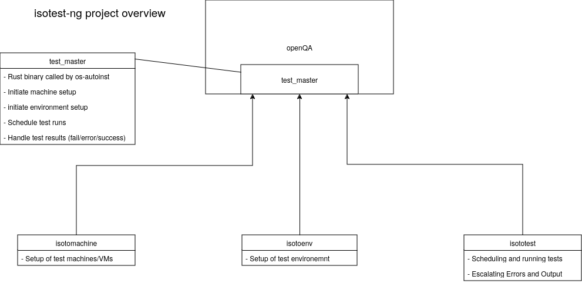

# isotest-ng Documentation

Welcome to the current documentation hub for `isotest-ng`. In here you can find documentation about the project itself
including schematic drawings, design considerations, developer information, etc.

Have fun browsing and if you have any questions, do not hesitate to ask.

1. [Design Considerations](./design_considerations.md)
2. [Security Policy](./SECURITY.md)
3. [Contribution Guidelines](./CONTRIBUTING.md)

